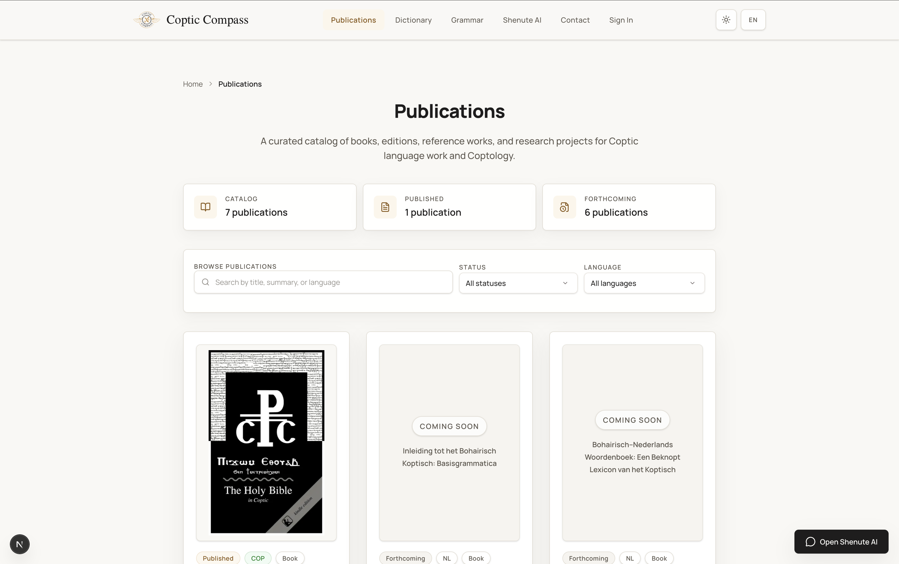

# Coptic Compass | Coptic Dictionary, Grammar, and Publications


Coptic Compass is a digital home for Coptic study, bringing together a searchable dictionary, published grammar lessons, academic publications, a public grammar API, and private learning workspaces for students and instructors. The platform is built by Kyrillos Wannes.

> Live site: [kyrilloswannes.com](https://kyrilloswannes.com)
>
> Repository: [github.com/KyroHub/CopticCompass](https://github.com/KyroHub/CopticCompass)

## What the App Includes

- A searchable Coptic dictionary with 6,408 checked-in entries and support for Coptic, English, and Greek lookup.
- Published grammar lessons with exercises, footnotes, concept glossaries, and links back to dictionary entries and sources.
- A publications section for published and forthcoming books connected to the broader Coptic project.
- A public grammar API with JSON endpoints and OpenAPI documentation for reuse in other tools and teaching workflows.
- A private student dashboard for profile settings, grammar progress, bookmarks, notes, and exercise submissions.
- A private instructor workspace for reviewing and grading student submissions.
- English and Dutch interfaces, with legacy non-localized routes redirecting to localized pages.

## Highlights

- Fast lexical browsing with support for Coptic script and a built-in virtual keyboard.
- Rich entry pages with grammatical detail, dialect forms, and related content.
- Grammar lessons that connect terminology, examples, sources, learner progress, and dictionary entries in one reading flow.
- A versioned grammar dataset exported to `public/data/grammar/v1` and shared by the site, API, and developer docs.
- Private learner and instructor flows built around submissions, feedback, bookmarks, notes, and profile management.
- Developer-facing grammar endpoints and docs for lessons, concepts, examples, exercises, footnotes, sources, and the OpenAPI spec.

## Interface Preview

<p>
  
  
</p>

<p>
  
  
</p>

## Stack

- Framework: Next.js 16 with the App Router
- Language and UI: TypeScript, React 19, Tailwind CSS 4
- Auth and storage: Supabase SSR, Postgres, and Storage
- Charts and analytics: Recharts
- Theme support: `next-themes`
- API docs: OpenAPI + Swagger UI
- Testing: Vitest + Playwright
- Data delivery: checked-in JSON in `public/data`, with grammar exports generated from typed source modules in `src/content/grammar`

## Runtime Assumptions

- Production is currently designed around Next.js running on the Node.js runtime, typically on Vercel.
- Cloudflare works well in front of the app as DNS, CDN, or proxy, but the app is not currently structured for Cloudflare Workers or other Edge-only runtimes.
- Some server modules read local project files at build or request time, including dictionary JSON files in `public/data`, grammar exports, and source timestamps used by the sitemap.
- If you later want to move more of the app to Edge or Worker runtimes, these filesystem reads should be replaced with build-time imports, generated manifests, or storage/API-backed lookups.

## Local Development

```bash
git clone https://github.com/KyroHub/CopticCompass.git
cd CopticCompass
nvm use
npm install
npm run dev
```

Then open [http://localhost:3000](http://localhost:3000).

The repository includes [`.nvmrc`](./.nvmrc) to pin the local Node.js version used in CI.

For Playwright smoke tests, install the Chromium browser once:

```bash
npx playwright install chromium
```

### Environment Setup

Copy the example file only if you want to enable Supabase auth, profile avatars, contact email, owner notifications, or distributed rate limiting locally:

```bash
cp .env.example .env.local
```

Then replace the placeholder values in `.env.local` with your own local credentials.

Additional notes:

- `SUPABASE_SERVICE_ROLE_KEY` is only needed for trusted server-side workflows such as internal message persistence or notification dispatching.
- `CONTACT_EMAIL` is the public contact inbox destination.
- `OWNER_ALERT_EMAIL` is for operational alerts such as new signups or exercise submissions.
- `NOTIFICATION_FROM_EMAIL` is the sender identity used by app-generated notification emails.

Important:

- `.env.local` is gitignored and should never be committed.
- [`.env.example`](./.env.example) contains placeholders only and is safe to track.
- If you skip environment setup, public pages and the read-only grammar API still work, but auth, dashboards, avatar uploads, instructor review, and email-backed features may be unavailable.

Useful commands:

```bash
npm run lint
npm run format
npm run format:check
npm run test
npm run data:grammar:export
npm run test:e2e:local
npm run build
```

## Code Organization

- Localized public pages live under `src/app/(site)/[locale]`.
- Legacy non-localized routes live under `src/app/(app)` and mostly redirect into the localized public routes.
- Feature-owned server helpers and query modules generally live close to their feature under `src/features/*/lib/server`.
- Shared server actions live under `src/actions`, with admin workflows split by domain under `src/actions/admin`.
- Shared SEO helpers live in `src/lib/metadata.ts`, `src/lib/structuredData.ts`, `src/app/sitemap.ts`, and `src/app/robots.ts`.

For a fuller walkthrough of the current structure, see [docs/architecture.md](./docs/architecture.md).

### Signup Alert Webhook

This repo includes a Supabase Edge Function at `supabase/functions/profile-signup-alert` that sends an owner alert whenever a new row is inserted into `public.profiles`.

To enable signup alerts in a Supabase project:

1. Set function secrets for `RESEND_API_KEY`, `OWNER_ALERT_EMAIL`, and `NOTIFICATION_FROM_EMAIL`.
2. Deploy the function:

```bash
supabase functions deploy profile-signup-alert --project-ref <your-project-ref>
```

3. Create a database webhook on `public.profiles` for `INSERT` events.
4. Choose `Supabase Edge Functions` as the webhook target, select `profile-signup-alert`, and add the auth header with service key.

For local development with `supabase start`, you can still test the function itself locally with `supabase functions serve`, but the project-side signup alert activation happens in the hosted Supabase project dashboard.

### Background Release Delivery

This repo also includes a Supabase Edge Function at `supabase/functions/process-content-release` for background delivery of approved content releases. When Resend segment configuration is available, the worker hands release sends off to provider-native broadcasts. If that configuration is missing, it falls back to the app's direct per-recipient delivery flow.

To enable background release sends in a Supabase project:

1. Set function secrets for `NOTIFICATION_FROM_EMAIL` and at least one Resend key:
   - `RESEND_API_KEY` for direct-send fallback
   - `RESEND_API_KEY_FULL_ACCESS` for Contacts, Segments, and Broadcasts
2. Deploy the function:

```bash
supabase functions deploy process-content-release --project-ref <your-project-ref>
```

3. Make sure the latest release delivery migrations have been pushed so `content_releases` includes the queue metadata columns.

### Resend Audience Sync

Audience opt-ins can be mirrored into Resend Contacts and Segments so provider-native broadcasts are possible.

Set these app environment variables where your Next.js server runs:

- `RESEND_API_KEY_FULL_ACCESS`
- `RESEND_LESSONS_SEGMENT_ID`
- `RESEND_BOOKS_SEGMENT_ID`
- `RESEND_GENERAL_SEGMENT_ID`
- `RESEND_LESSONS_EN_SEGMENT_ID`
- `RESEND_LESSONS_NL_SEGMENT_ID`
- `RESEND_BOOKS_EN_SEGMENT_ID`
- `RESEND_BOOKS_NL_SEGMENT_ID`
- `RESEND_GENERAL_EN_SEGMENT_ID`
- `RESEND_GENERAL_NL_SEGMENT_ID`

Keep `RESEND_API_KEY` for normal send-only email delivery if you want, and use `RESEND_API_KEY_FULL_ACCESS` for Contacts, Segments, and Broadcast operations.

The three base segment IDs are used for topic-level audience sync. The six optional locale-specific segment IDs are used when sending localized EN/NL release broadcasts through Resend. If you do not set the locale-specific segment IDs, localized releases continue to fall back to direct per-recipient delivery.

Once those are set and the latest audience-contact sync migration has been pushed, the admin dashboard includes a manual audience backfill action and future audience preference changes will sync automatically on a best-effort basis.

## Data Workflows

### Grammar

Grammar lesson source files live under `src/content/grammar`. They are exported into public JSON files used by the site and API.

```bash
npm run data:grammar:export
```

The export writes to `public/data/grammar/v1` and also runs automatically before production builds.

### Dictionary

The public dictionary currently ships from the checked-in dataset at `public/data/dictionary.json`.

## Public Grammar API

The repository exposes a read-only public grammar dataset.

Key entry points:

- `/api/v1/grammar`
- `/api/v1/grammar/manifest`
- `/api/v1/grammar/lessons`
- `/api/v1/grammar/concepts`
- `/api/v1/grammar/examples`
- `/api/v1/grammar/exercises`
- `/api/v1/grammar/footnotes`
- `/api/v1/grammar/sources`

Docs and developer pages:

- `/api-docs`
- `/api/openapi.json`
- `/en/developers`
- `/nl/developers`

## Project Status

Currently implemented in the app:

- Searchable Coptic dictionary
- Published grammar lesson system
- Publications section
- Public grammar API and API docs
- English and Dutch localized UI
- Student dashboard with profile and learning progress
- Instructor submission review workspace

Current areas of active maintenance:

- More published grammar lessons
- Expanded publication metadata and coverage
- Editorial and lexical data cleanup
- Submission and review workflow polish
- Further polish for contributor and developer documentation

## Contributing

Contributions are welcome, especially around lexical corrections, metadata cleanup, UI refinements, and teaching-oriented improvements.

If you want to propose a correction or addition, start with [CONTRIBUTING.md](./CONTRIBUTING.md).

## License

This repository uses a split licensing model:

- Source code: [MIT License](./LICENSE)
- Grammar lesson content and dataset exports: all rights reserved unless stated otherwise in dataset rights metadata
- Dictionary data and publication metadata: please preserve scholarly attribution and source context when reusing or adapting material
