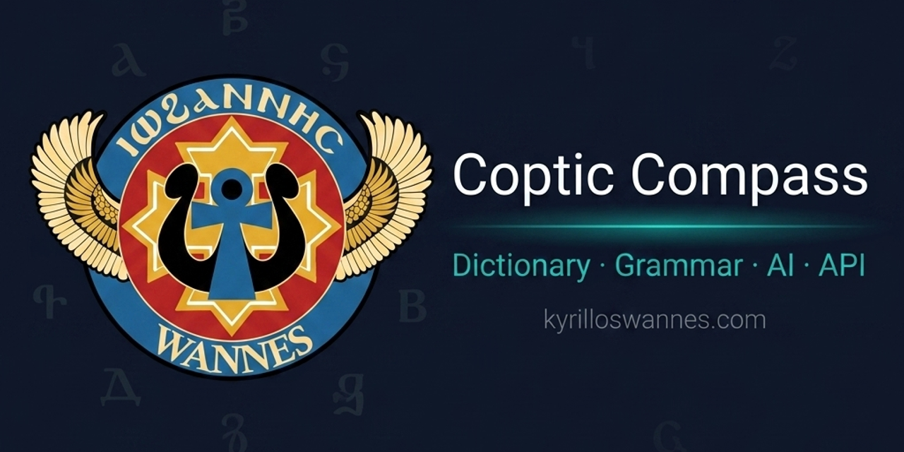
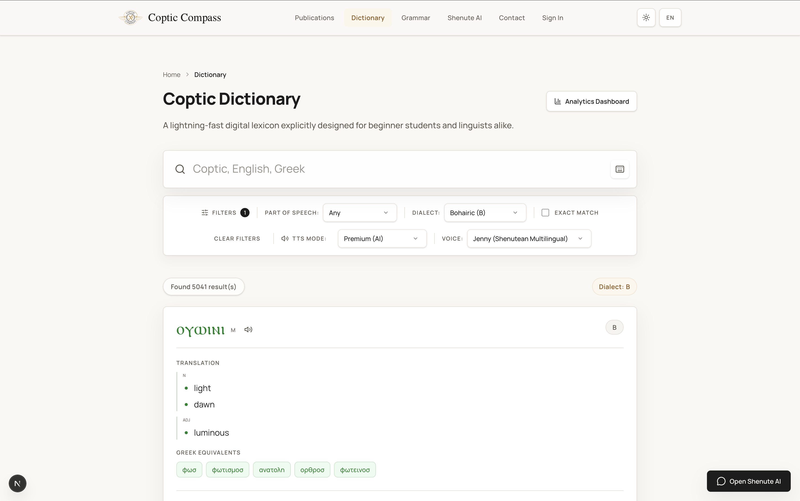
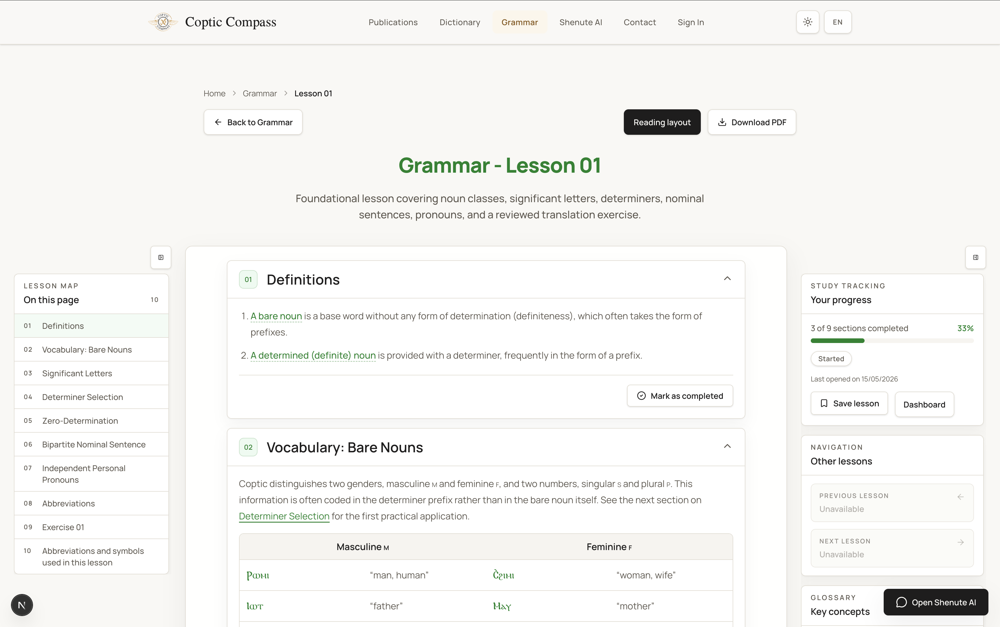

<div align="center">
  

  <h3>A digital home for Coptic study.</h3>
  
  <p>Dictionary · Grammar · AI Assistant · Public API</p>

  <div>
    <a href="https://kyrilloswannes.com"></a>
    <a href="https://github.com/KyroHub/CopticCompass/blob/main/LICENSE"></a>
    <a href="https://github.com/KyroHub/CopticCompass/pulls"></a>
  </div>
</div>

---

**Coptic Compass** brings together a searchable dictionary, published grammar lessons, academic publications, Shenute AI, and private learning workspaces—built by Copts, for Copts.

## Features

- **Searchable Dictionary:** 6,400+ checked-in entries with Coptic, English, and Greek lookup. Includes dialect forms and a built-in virtual keyboard.
- **Interactive Grammar Lessons:** Reading and study modes with exercises, footnotes, and concept glossaries linked directly to dictionary sources.
- **Shenute AI Assistant:** OCR-assisted image prompts backed by pgvector RAG, integrating THOTH AI, OpenRouter, Gemini, and Hugging Face.
- **Public Grammar API:** Read-only JSON endpoints and OpenAPI documentation for developers and educators.
- **Student & Instructor Workspaces:** Private dashboards for progress tracking, exercise submissions, reviews, and notifications.
- **Localized UI:** Full support for both English and Dutch.

## Interface

<p align="center">
  
  
</p>

## Quickstart

The application is built on Next.js 16 (App Router), React 19, Tailwind CSS 4, and Supabase.

```bash
git clone https://github.com/KyroHub/CopticCompass.git
cd CopticCompass
nvm use
npm install
npm run dev
```

Open [http://localhost:3000](http://localhost:3000) in your browser.

> [!NOTE]  
> To enable Supabase auth, AI routing, or email features locally, copy `.env.example` to `.env.local` and add your credentials. See our [Architecture Docs](docs/architecture.md) for more details.

## Documentation

For deep dives into the technical architecture, environment setup, API surfaces, or localization guidelines, see the `docs/` directory:

- [Architecture & Workflows](docs/architecture.md)
- [Environment & Deployment Setup](docs/environment-setup.md)
- [API, AI, and Data Workflows](docs/api-and-workflows.md)
- [AI & RAG Distillation Pipeline](docs/distillation.md)
- [Dutch Localization Style Guide](docs/dutch-localization-style-guide.md)

## Contributing

Contributions are welcome! Whether it's lexical corrections, UI refinements, or pedagogical improvements, we'd love your help.

Please read [CONTRIBUTING.md](CONTRIBUTING.md) and review our [Code of Conduct](CODE_OF_CONDUCT.md) before submitting a pull request.

## License & Attribution

- **Source code:** [MIT License](LICENSE)
- **Content & Data:** Grammar lessons, dictionary data, and publication metadata are subject to specific academic rights. Please preserve scholarly attribution and source context when reusing material.
- **THOTH AI Credits:** Created by Dr. So Miyagawa (University of Tsukuba). [Learn more](https://somiyagawa.github.io/THOTH.AI/).
