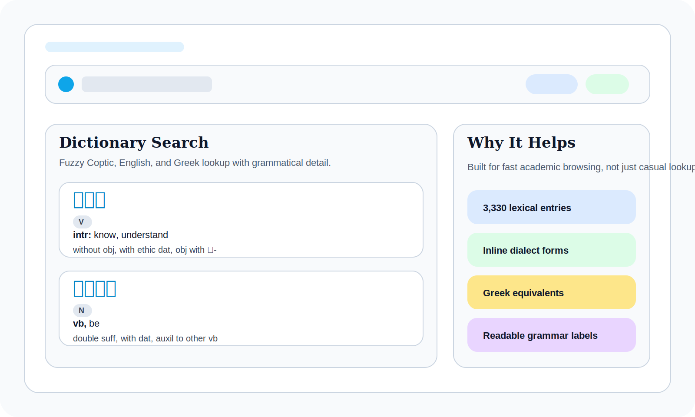
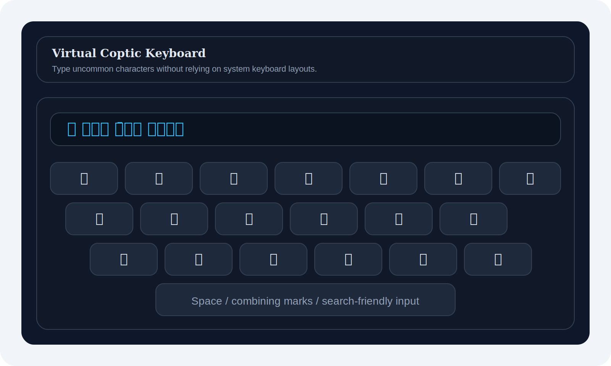

# Wannes Portfolio & Coptic Dictionary


Scholarly portfolio and digital Coptic-English dictionary by Kyrillos Wannes, built for fast lexical browsing, bilingual study, and academic presentation.

> Live site: [kyrilloswannes.com](https://kyrilloswannes.com)
>
> Repository: [github.com/KyroHub/portfolio](https://github.com/KyroHub/portfolio)

## Highlights

- Browse a 3,330-entry Coptic dictionary with fuzzy search across Coptic, English, and Greek.
- Type Coptic directly in the browser with a built-in virtual keyboard.
- Inspect grammatical and dialectal forms inline, including absolute, nominal, pronominal, and stative states.
- Explore analytics views for parts of speech, noun genders, and dictionary coverage patterns.
- Switch between English and Dutch interfaces for wider teaching and classroom use.

## Interface Preview

Illustrated preview panels for the dictionary experience and built-in keyboard. These can be swapped for recorded browser screenshots or GIFs later.

<p>
  
</p>

<p>
  
</p>

## Stack

- Framework: Next.js 16 with the App Router
- Language: TypeScript
- Styling: Tailwind CSS 4
- Charts: Recharts
- Theme support: `next-themes`
- Data pipeline: Excel -> TypeScript parser -> static JSON

## Local Development

```bash
git clone https://github.com/KyroHub/portfolio.git
cd portfolio
npm install
npm run dev
```

Open [http://localhost:3000](http://localhost:3000) after the dev server starts.

## Data Pipeline

The dictionary data is generated from an Excel source and published as static JSON for the app.

```bash
npx ts-node scripts/parseExcel.ts
```

This regenerates:

- `public/data/dictionary.json`
- `public/data/woordenboek.json` when you additionally run the translation workflow

Related scripts:

- `scripts/parseExcel.ts`: parses the source spreadsheet into `dictionary.json`
- `scripts/translateDictionary.ts`: builds or resumes the Dutch dataset
- `scripts/rewriteDictionary.ts`: utilities for dictionary maintenance

## Roadmap

- Publications section with richer metadata, covers, and outbound links
- Expanded Coptic Grammar lessons beyond lesson 1
- Coptic Learner companion flows for guided study
- Offline-first/PWA support for classroom and field use
- Better README/media polish with real browser screenshots or short GIF walkthroughs
- Submission tooling for new dictionary entries and editorial review

## Contributing

Contributions are welcome, especially around dictionary corrections, metadata cleanup, UI polish, and teaching features.

If you want to propose new entries or lexical corrections:

1. Update the Excel source used by `scripts/parseExcel.ts`.
2. Regenerate the JSON output.
3. Include a clear note about the source, rationale, or scholarly correction in your PR.

The full workflow lives in [CONTRIBUTING.md](./CONTRIBUTING.md).

## GitHub Polish Still Worth Doing

These items need GitHub-side configuration rather than code changes inside the repo:

- Update the repository name and short description for better discoverability
- Add GitHub topics such as `coptic`, `linguistics`, `dictionary`, `nextjs`, `typescript`, `digital-humanities`, and `tailwindcss`
- Set the final production domain in the repo About panel and social preview settings if needed

## Licensing

This repository uses a split licensing model:

- Source code: [MIT License](./LICENSE)
- Dictionary dataset: CC-BY 4.0 attribution expectations for the lexical material in `public/data/dictionary.json`

Please preserve scholarly credit when reusing or adapting the dataset.
